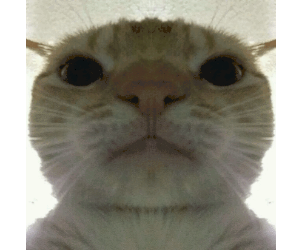

# Hi there 👋, I'm Ahmad Rafi

## 👨‍💻 About Me
I am passionate about IoT, web development, and building practical projects that solve real-world problems.  
Currently interning at **PT Bahana Bhumiphala Persada** in IT.  

- 🌱 I’m currently learning **Advanced IoT systems and Smart Home automation**  
- 💬 Ask me about **IoT, Python, ESP32, React, Tailwind, and Node.js**  
- 📫 How to reach me: [ahmadrrafi47@gmail.com](ahmadrrafi47@gmail.com)  
- ⚡ Fun fact: I love turning ideas into **practical and efficient tech solutions**  

---

---

## 🛠️ Skills & Tools

---

## 📂 Projects & Portfolio

### 🔹 Fire Detection IoT System
- **Description:** Real-time fire detection using ESP32-S3, OV5640 camera, flame sensors, and Telegram bot notifications.  
- **Repo:** [Fire Detection IoT](https://github.com/USERNAME/fire-detection-iot)  
- **Tech:** ESP32, Python, Telegram Bot, Sensors

### 🔹 Smart Home Dashboard
- **Description:** Web dashboard for controlling smart home devices with IoT integration.  
- **Repo:** [Smart Home Dashboard](https://github.com/USERNAME/smart-home-dashboard)  
- **Tech:** React, Tailwind CSS, Node.js, MQTT

### 🔹 Personal Portfolio Website
- **Description:** Responsive portfolio website to showcase projects and skills.  
- **Repo:** [Portfolio Website](https://github.com/revvayn/portfolio-website)  
- **Tech:** React, Tailwind CSS, Vite

---

## 📫 Contact Me
- LinkedIn: [linkedin.com/in/USERNAME](https://www.linkedin.com/in/ahmad-rafi-186065335/)  
- Email: [email@example.com](ahmadrrafi47@gmail.com.com)  
