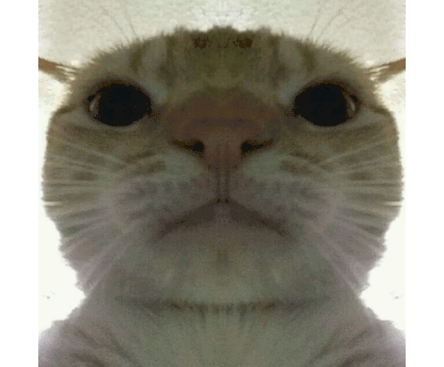

# Hi there 👋, I'm Ahmad Rafi

## 👨‍💻 About Me

I am passionate about **IoT**, **web development**, and building **practical projects** that solve real-world problems.
Currently working at **PT Jayamas Medica Industri Tbk** as an **IT Support Specialist**.

* 🌱 Currently learning **Advanced IoT Systems and Web Development**
* 💬 Ask me about **IoT, Python, ESP32, React, Tailwind CSS, and Node.js**
* 📫 How to reach me: **[ahmadrrafi47@gmail.com](mailto:ahmadrrafi47@gmail.com)**

---

---

## 🛠️ Skills & Tools

---

## 📂 Projects & Portfolio

### 🔹 Projects Coming Soon 🚀

Currently working on several **IoT and web-based projects**, including ESP32 systems and dashboard applications.

Stay tuned for updates!

---

## 📫 Contact Me

* 💼 LinkedIn: [Ahmad Rafi](https://www.linkedin.com/in/ahmad-rafi-186065335/)
* ✉️ Email: **[ahmadrrafi47@gmail.com](mailto:ahmadrrafi47@gmail.com)**

---

⭐️ *Feel free to explore my repositories and connect with me!*
